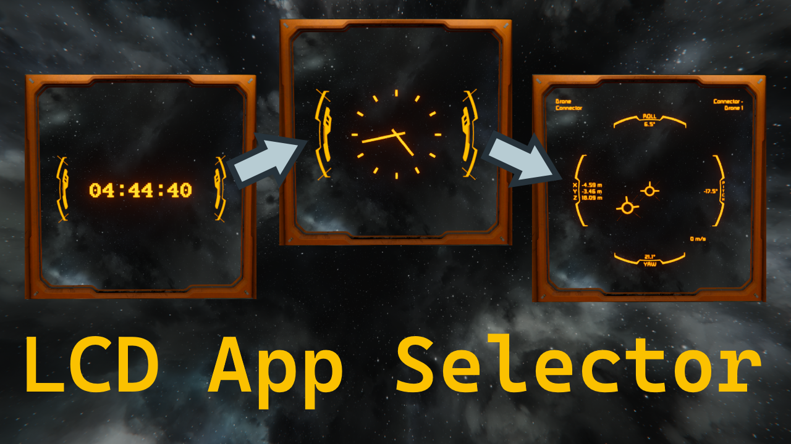

# LCD Screen App Selector

The LCD Screen App Selector is a modification for 
[Space Engineers by Keen Software House](https://www.spaceengineersgame.com/home/). It allows 
changing the currently displayed app on any LCD via the "run" function of the programmable block 
(PB).

It's main purpose was to work together with the 
[Connector Align App](https://github.com/Kiminaze/SEConnectorAlignApp) but it can be used on its 
own.

### Video Showcase

https://www.youtube.com/watch?v=5Y65UWF-Vok 
(switching happens at ~8 and ~42 seconds)

## 🛠 Usage

- When inside your ship's terminal, drag the PB to your hotbar and select "Run".
- Enter `"<block name>" <screen number> "<app name>"` where
  - `block name` Name of the block with the LCD screen (e.g. `Transparent LCD`).
  - `screen number` Zero based number of the screen (usually `0`).
  - `app name` Internal name of the app (not its display name!).
- Example that works with a block named "MyLCD" and displays the clock:
 `"MyLCD" 0 "TSS_ClockAnalog"`
- Example that works with a block named "Transparent LCD" and displays the 
[Connector Align App](https://github.com/Kiminaze/SEConnectorAlignApp):
 `"Transparent LCD" 0 "ConnectorAlignApp"`
- Setting the app name to an empty string (`""`) removes any currently present app.
 `"MyLCD" 0 ""`
- Setting a non-existent app name results in the PB displaying all available app names in its 
Info Panel in the bottom right of the terminal.

## 💾 Download

https://steamcommunity.com/sharedfiles/filedetails/?id=3687620980

## Copyright

LCD Screen App Selector for Space Engineers

Copyright (C) 2026 Philipp Decker - kiminaze@yahoo.de

This program is free software: you can redistribute it and/or modify
it under the terms of the GNU General Public License as published by
the Free Software Foundation, either version 3 of the License, or
(at your option) any later version.

This program is distributed in the hope that it will be useful,
but WITHOUT ANY WARRANTY; without even the implied warranty of
MERCHANTABILITY or FITNESS FOR A PARTICULAR PURPOSE.  See the
GNU General Public License for more details.

You should have received a copy of the GNU General Public License
along with this program.  If not, see <https://www.gnu.org/licenses/>.
